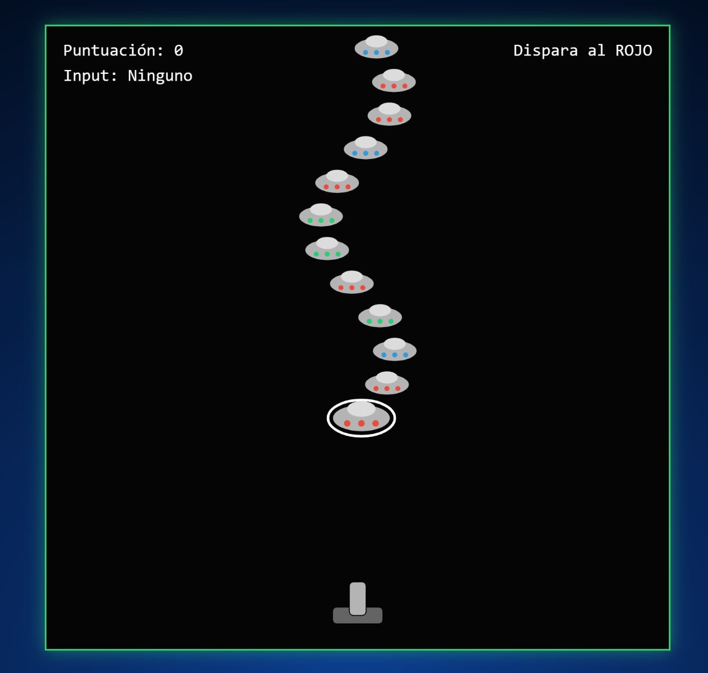
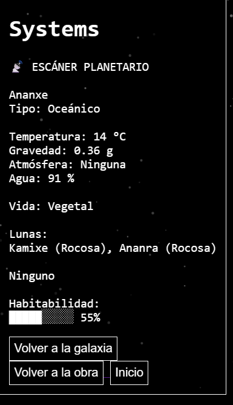

TEMATICA PRINCIPAL:

La temática principal de la obra es el espacio exterior. Creemos conocer muy bien nuestro mundo, pero lo que hay máss alla de nuestro planeta es un misterio para nosotros, el espacio exterior puedo estar lleno de múltiples peligros o bellezas. En este portafolio doy al usuario la experiencia de viajar en el espacio y adentrarse en un vasto oceanó donde todo es posible.

OBRAS DISPONIBLES:

El portafolio consiste en 5 obras interactivas diferentes diferentes.

Constelaciones:
En esta obra al usuario se le da un canvas totalmente en negro, sin ningun tipo de luz o texto. El canvas representa la noche, duarnte la noche la oscuridad reina sobre nuestro planeta, pero hay unas pequeñas amigas que nos ayudan a iluminar esta oscxuridad, las estrellas. A partir del canvas el usuario puede crear su propio grupo de estrellas para iluminar su noche.

Link de la obra: https://porfolio-creativo-david-morera.vercel.app/sketches/constelation/index.html

Nebulosa:
En esta obra el usuario interactua con una nebulosa, una nebulosa es una nube de gas que se puede encontrar en el espacio, la nebulosa nos da un espectaculo de luz increible. Es por elllo que esta obra el usuario le da forma a esta nebulosa a partir de su voz

Link de la obra: https://porfolio-creativo-david-morera-git-main-morri2005s-projects.vercel.app/sketches/nebula/index.html

Cohete:
En esta obra el usuario interactua con un cohete, el transporte fundamental para viajar al espacio es un cohete. El viaje en el espacio no es un camino lleno de rosas, a veces puede resultar muy peligroso viajar en este, es por ello que en esta obra el usuario toma el papel del capitan de un cohete el cual tiene que pasar por una nube de asteroides. El usuario tendra que pilotar la nave a partir de su voz. Detro de la carpeta de rocket, hay una carpeta con las imagenes para jugar al juego.

Link de la obra: https://porfolio-creativo-david-morera-git-main-morri2005s-projects.vercel.app/sketches/rocket/index.html

Defender:
En esta obra el usuario tiene que defender el planeta de alienigenas, muchos creen que nosotros no somos la única forma de vida inteligente en el universo y que ahí fuera existen otras especies que podrian estar obsevándonos y inetnar atacar nuestro planeta. Para derribar sus naves, el usuario tiene que mostrar el color correcto en la camara para derribar la nave.

Link de la obra: https://porfolio-creativo-david-morera-git-main-morri2005s-projects.vercel.app/sketches/defender/index.html

Sistemas:
Esta es quiza la obra más compleja de todo el portafolio, en esta obra el usuario se le da la oportunidad de explorar una galaxia. Nosotros vivimos en una galaxia, pero ahí fuera hay millones de estas y cada uno con sus propios sistemas solares. Es por ello que en esta obra puedes explorar diferentes galaxias ceadas de forma aleatoria y investigar sus sistemas con sus planetas, a partir de la funcion de escaner descubre más datos obre los planetas.

Link del proyecto: https://porfolio-creativo-david-morera-git-main-morri2005s-projects.vercel.app/sketches/systems/index.html
